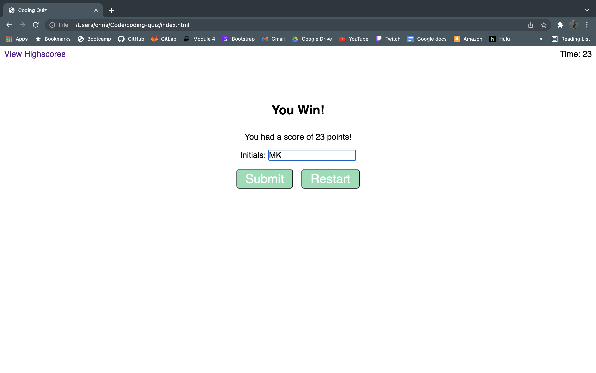

# coding-quiz

A multiple choice quiz that, on pressing a start button, should generate a random question for the user about Pokemon, each with 4 multiple choice answers.  The game should let the user know if they choose the correct or incorrect answer. All while there is a timer counting down how long the user has left to finish the quiz. If the user finishes in the allotted time, they should give their initials and their score should be stored in local storage and kept to view from the high score link on the page. 

# Links

[coding-quiz Github URL](https://cavazosdotcom.github.io/coding-quiz/)

[coding-quiz Github Repo URL](https://github.com/cavazosdotcom/coding-quiz)

# Picture

# JS

- This was, so far, the most challenging project for me. Having to do more complex functions in JS was difficult to work through. Starting from scratch was good practice to experience the full development process for this kind of page, and having to think outside the box lots of times, most to no avail, was the best part about this project. I want to practice more with template literals because they seem very practical in complex projects, and having those become second nature will surely have great benefits. Every challenge in this felt uphill having to work through them, but I'm happy I stuck through and made a project I'm proud of. There are a few things I still want to add to go above and beyond but I can do that after I've caught up to everything.

# CSS

- After banging my head against a wall for most of HW2 with our portfilios, CSS has begun to make A LOT more sense to me. The hurdle of HW2 seems so easy now compared to when I accomplished it a few weeks ago. Although flexboxes are still a beast among itself

# HTML

- Planning from the start how the page should be layed out and how it will interact with the JS was crucial. In the future I'll probably spend a good chunk of time more planning out my page, and probably creating a full static page/pages with CSS before I even touch JS. It seems easier to add JS to an existing page then to add CSS to a functional page. 